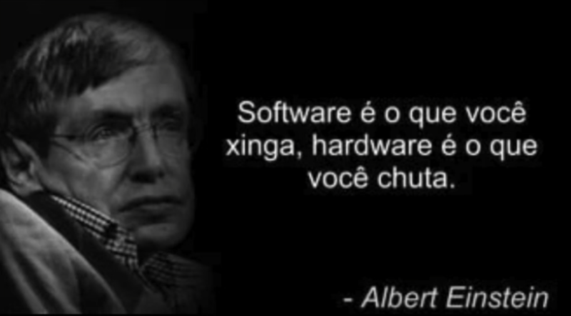

# QuantumPy

Acho que tenho que muda o nome, não fica legal para um repositório de estudos, parece nome de framework

## Alguma coisa de Mecânica Quântica fds

Tava com tedio então fiz 👍



~Albert Einstein

Eu estava la ele realmente falou isso

inicializando a venv

```bash
python -m venv venv
source venv/bin/activate  # Linux/MacOS
venv\Scripts\activate
```

instalando as dependências

```bash
pip install -r requirements.txt
```
